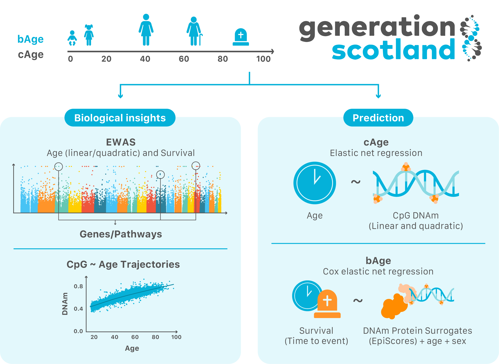

# Refining epigenetic prediction of chronological and biological age

## cAge/bAge predictors

Scripts to predict cAge and bAge from DNA methylation data (namely Illumina's 450K chips) can be found in the following directories:
- cAge prediction: `cage_predictor/`
- bAge prediction: `bage_predictor/`

cAge predictions can also be obtained using the Shiny App MethylDetectR: https://shiny.igmm.ed.ac.uk/MethylDetectR/
*bAge predictions require previous calculations of GrimAge components via Horvath's online calculator: http://dnamage.genetics.ucla.edu/new*

## Visualization of CpG ~ age trajectories

CpG beta values across age in a subset of unrelated individuals (N = 4,450) in the Generation Scotland cohort can be visualized in the shiny app MethylBrowsR.

https://shiny.igmm.ed.ac.uk/MethylBrowsR/

## Creation of predictors/analysis scripts

Scripts that accompany our paper "Refining epigenetic prediction of chronological and biological age".

Scripts divided into 4 main portions of paper:
- Age EWAS: `ewas/age_ewas/`
- Survival EWAS: `ewas/survival_ewas/`
- Age prediction epigenetic models: `prediction_creation/`
    - cAge prediction models
    - bAge prediction models

