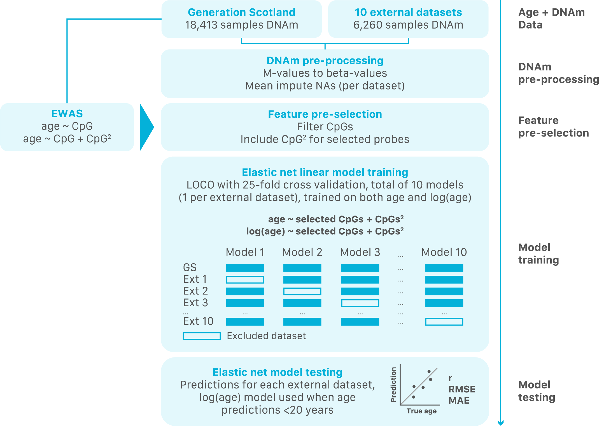
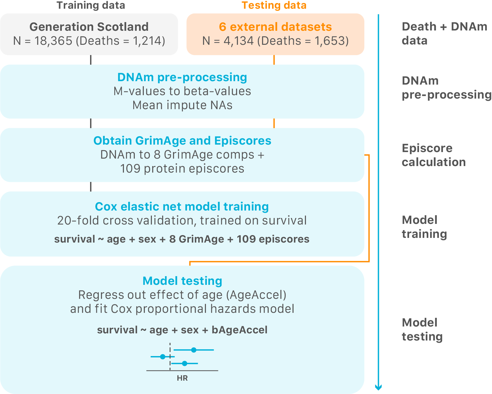

Scripts to fit models for chronological (cAge) and biological (bAge) age prediction. 

`chronological_age.py` and `biological_age.py` contain parameters than can be altered as per the specs of a given run by feeding these to them via flags in the command line (try `python chronological_age.py -h` or `python biological_age.py -h`). Based on the user's input different parts of the analysis can be run, with different options. Here I briefly detail the steps that each of the scripts takes to reach the final prediction models as well as the testing of the latter. They themselves are just mostly wrapper scripts that call upon other scripts within the `chronological_age/` and `biological_age/` subdirectories respectively. 

I also detail the exact parameters used to obtain the models described in our preprint "Refining epigenetic prediction of chronological and biological age". 

Many parameters included in these scripts were not used in the final results described in our paper, hence I won't describe them in extensive detail, but if any doubt arises please feel free to contact me. 

# Chronological age

## Prediction creator flowchart

## User specifications

`chronological_age.py` works as other command line programs in that it takes flags that enable it to do certain things. The flags that can be specified and what they do are:

~~~
usage: chronological_age.py [-h] [--folds] [--trainprep] [--diagnose] [--train] [--test] [--wave4] [--external] [--nonrandom] [--gsnorm] [--cpg CPG] [--name NAME] [--cpg_train]
                            [--sample_train] [--subset] [--subset_n {1,2,3,4,5,10,15,20,35,50,75,100,200,300}] [--loo] [--sex] [--squared] [--squared_subset]
                            [--squared_subset_n {100,200,300,400,500,600,700,800,900,1000,1250,1500,2000,3000,5000,7500,10000,12500,15000,20000}] [--cpg2]
                            [--cpg2_n {0.1,0.2,0.3,0.4,0.5,0.6,0.7,0.8,0.9,1,1.25,1.5,2,3,4,5,10,15,20,35,50,75,100,200,300}] [--age2cpg2] [--trandom] [--lasso] [--logage]
                            [--sample_test] [--cpg_test] [--lbc_test] [--logage20] [--cohort COHORT]

cAge analysis pipeline.

optional arguments:
  -h, --help            show this help message and exit
  --folds               Option to assign batches to folds. WARNING: Needs to be run at least once prior to training.
  --trainprep           Option to prepare training data prior to fitting models. WARNING: Needs to be run at least once prior to training.
  --diagnose            Option to diagnose data sets used in analysis prior to fitting models.
  --train               Option to train models.
  --test                Option to test models.
  --wave4               Option to run with all of GS (waves 1, 3, and 4) instead of just waves 1 and 3 as base of models.
  --external            Option to use external data to train (LBC21/36 and GEO datasets).
  --nonrandom           Option to assign batches to folds in ascending order instead of randomly.
  --gsnorm              Option to use the 20k normalized GS methylation file instead of independent wave files.
  --cpg CPG             CpG that we want to obtain the trajectory of in our diagnostics, default is ELOVL2.
  --name NAME           Name to add to generic run name.
  --cpg_train           Option to scale per CpG in training, per CV fold.
  --sample_train        Option to scale per sample in training.
  --subset              Option to limit training to most associated CpGs to age.
  --subset_n {1,2,3,4,5,10,15,20,35,50,75,100,200,300}
                        Number (integer) of Ks of top CpGs to include in training (default is 20, so top 20K CpGs).
  --loo                 Leave-one-out option when training and testing with GEO datasets (one model will be fit excluding the set to then be tested on, for all sets considered
                        except GS and LBC).
  --sex                 Option to sex-stratify models.
  --squared             Option to also include CpG^2 in models. Will include CpG^2 for all CpGs already in model.
  --squared_subset      Option to also include CpG^2 in models, selecting from CpGs most associated to age^2. If selected, it overrides --squared.
  --squared_subset_n {100,200,300,400,500,600,700,800,900,1000,1250,1500,2000,3000,5000,7500,10000,12500,15000,20000}
                        Number (integer) of top CpGs^2 for age to include in training (default is 900).
  --cpg2                Option for squared CpGs to be obtained from age + CpG2 EWAS, not from age^2 EWAS.
  --cpg2_n {0.1,0.2,0.3,0.4,0.5,0.6,0.7,0.8,0.9,1,1.25,1.5,2,3,4,5,10,15,20,35,50,75,100,200,300}
                        Number (integer) of top CpGs^2 for age to include in training (default is 5K).
  --age2cpg2            Option to include both CpG^2 derived from CpG^2-age EWAS and from age^2 EWAS. Subsets will be determined by already described options.
  --trandom             Option to ignore fold assignment and use totally random folds in training (totally random).
  --lasso               Option to use lasso instead of elastic net in training of models.
  --logage              Option to train on log(age) instead of age.
  --sample_test         Option to scale per sample in testing.
  --cpg_test            Option to scale CpG in testing, per cohort/study.
  --lbc_test            Include LBC in testing.
  --logage20            Option to test on log(age) for under 18s (non-log for older individuals).
  --cohort COHORT       Option to select cohort to test in
~~~

Within the "Base info" section of `chronological_age.py` the user can modify the paths of the data used/where they want things to be outputed. The data paths should not be necessary to change as they're in the shared group directory, so would just need to specify output directories (`ouput_dir_folds`, `ouput_dir_prep`, `ouput_dir_diagnose`, `output_dir_train`, and `output_dir_test`). Generally speaking the data within the "Base info" section doesn't need to be changed unless someone else is running things/wants to change where things are outputted or change something more substantial about the pipeline.

The flags given to `chronological_age.py` will alter certain variables that will then feed into the rest of the analysis and tell it what to do. 

## Fitting of cAge model described in paper

To fit the model described in our paper, the chronological_age.py script must be run with the following parameters and options (reasoning described in paper). Model is run twice, once training on age, and another on log(age).

~~~
python -u chronological_age.py --train --test --wave4 --external --loo --subset --subset_n 10 --squared_subset --cpg2 --cpg2_n 0.3 --trandom --lbc --loo
~~~

~~~
python -u chronological_age.py --train --test --wave4 --external --loo --subset --subset_n 10 --squared_subset --cpg2 --cpg2_n 0.3 --trandom --lbc --logage --logage20
~~~

### Description of selected parameters:

- `--train` and `--test` indicate that we want to do both training and testing in our run
- `--wave4` indicates that we want to include all GS sets in training
- `--external` indicates that we want to include external GEO + LBC datasets in training
- `--loo` indicates the use of a leave-one-out framework for training and testing
- `--subset` indicates that we want to subset the number of CpGs used in training
- `--subset_n` indicates the number of top CpGs from age EWAS that we want to include in training (1 = 1K, 2 = 2K, etc). Our final model uses 10K, hence `--subset_n 10`
- `--squared_subset` indicates that we also want to include a subset of squared CpGs in training
- `--cpg2` indicates that we want the squared CpG subsets to be derived from our age ~ CpG + CpG^2 EWAS
- `--cpg2_n` indicates the number of squared CPGs from the age ~ CpG + CpG^2 EWAS that we want to include in training. Our final model uses 300, hence `cpg2_n 0.3`
- `--trandom` indicates that we want samples to be totally randomly assigned to folds in training
- `--lbc` means that we want LBC samples to also be included in the final testing of our model, not just GEO samples
- `--logage` indicates that we want to train on log(age) as opposed to age
- `--logage20` indicates that we only want to use the model trained on log(age) to test on individuals that have already been predicted to be under 20 when testing using the model trained on age

Feature pre-selection effects on model performance was explored by running models tuning the --subset_n and --cpg2_n flags. 

# Biological age

## Prediction creator flowchart

## User specifications

The structure of `biological_age.py` is very similar to `chronological_age.py`, except it calls on scripts in the `biological_age/` sub-directory. As with `chronological_age.py`, the user can first specify output directories. The majority of variables/options are also the same in `biological_age.py`, with few exceptions:

~~~
usage: biological_age.py [-h] [--folds] [--train] [--test] [--wave4] [--gsnorm] [--deathage] [--age AGE] [--deathcause] [--cause CAUSE] [--kinship] [--sex] [--squared]
                         [--nonrandom] [--cpg_bage] [--cpg_subset]
                         [--cpg_subset_n {100,200,300,400,500,600,700,800,900,1000,1250,1500,1750,2000,3000,4000,5000,7500,10000}] [--combo_bage]

bAge analysis pipeline.

optional arguments:
  -h, --help            show this help message and exit
  --folds               Option to assign batches to folds. WARNING: Needs to be run at least once prior to training. No need if cAge analysis has already been run since
                        same file is used!
  --train               Option to train models.
  --test                Option to test models.
  --wave4               Option to run with all of GS (waves 1, 3, and 4) instead of just waves 1 and 3 as base of models.
  --gsnorm              Option to run with all of GS, where all waves have been normalized together.
  --deathage            Option to run with only deaths over certain age in training.
  --age AGE             Age to consider deaths over.
  --deathcause          Option to run with only certain causes of death in training.
  --cause CAUSE         Cause of death to consider in training.
  --kinship             Option to run with kinship matrix, obtain Martingale residuals, and then obtain predictor running elnet on that.
  --sex                 Option to sex-stratify models.
  --squared             Option to also include features^2 in models.
  --nonrandom           Option to assign batches to folds in ascending order instead of randomly.
  --cpg_bage            Option to obtain mortality predictor from methylation data instead of episcores.
  --cpg_subset          Option to obtain portality predictor from methylation data, subsetting to certain number of CpGs from mortality EWAS.
  --cpg_subset_n {100,200,300,400,500,600,700,800,900,1000,1250,1500,1750,2000,3000,4000,5000,7500,10000}
                        Number (integer) of top CpGs to include in training (default is 900).
  --combo_bage          Option to include both episcores and CpGs in training. Options for subsets same as before.
~~~

## Fitting of bAge model described in paper

To fit the model described in our paper, the chronological_age.py script must be run with the following parameters and options (reasoning described in paper).

~~~
python -u biological_age.py --train --test --wave4
~~~

### Description of selected parameters:

- `--train` and `--test` indicate that we want to do both training and testing in our run
- `--wave4` indicates that we want to train on all of GS